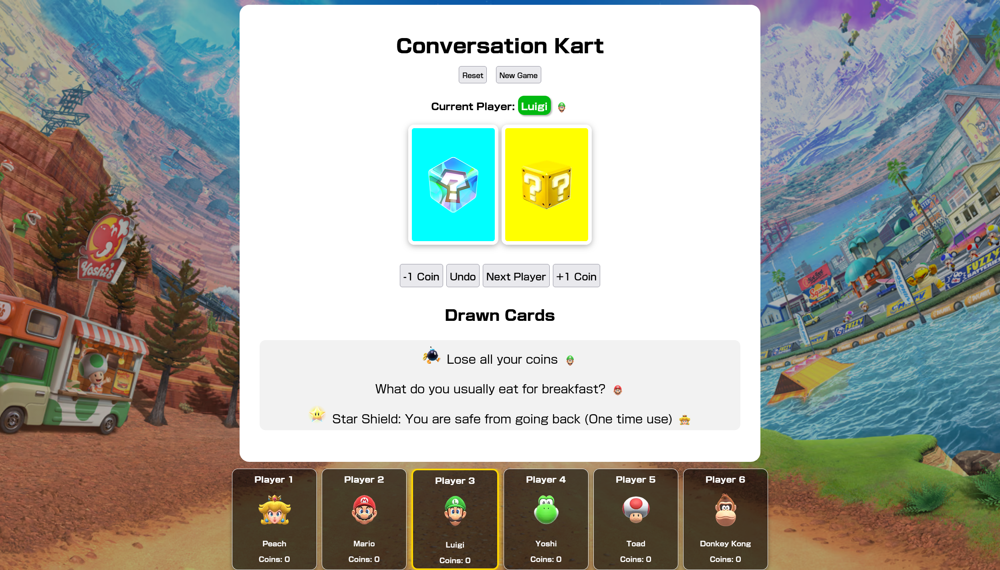

# 🏁 Conversation Kart

**Conversation Kart** is a browser-based supplementary app to my [Conversation Kart EFL board game](https://www.altopedia.net/users/7348-katienr).

Players must race to the finish, and they will take turns rolling a die to progress. They will encounter many objectives before they can reach the finish line, and this browser-based app is designed not only to help with tracking their progress, but to also make the game more fun and engaging.

### Preview:

## How to play

Download the original game board and print out enough sheets for your class. I recommend laminating the boards, so that the colours pop more.

Have one student in a group use their tablet or laptop to read the QR code and access the game. I have deployed the app using GitHub pages, but you can choose how you want to host it.

If you prefer a more analogue approach, included are the original mystery and question cards.

## Features

- Mystery Cards and Question Cards

- Colourful characters to make the game more engaging

- Drawn card history with a coin point tracker for players.

### Customisation

With the JavaScript file, it's easy to customise character details. You can also add your own questions and mystery cards to make it more tailored to your classroom.

**Good luck and have fun!**